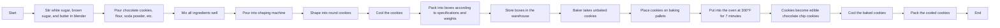

demo

```mermaid

graph LR
A[Start] --> B[Stir white sugar, brown sugar, and butter in blender]
B --> C[Pour chocolate cookies, flour, soda powder, etc.]
C --> D[Mix all ingredients well]
D --> E[Pour into shaping machine]
E --> F[Shape into round cookies]
F --> G[Cool the cookies]
G --> H[Pack into boxes according to specifications and weights]
H --> I[Store boxes in the warehouse]
I --> J[Baker takes unbaked cookies]
J --> K[Place cookies on baking pallets]
K --> L[Put into the oven at 300°F for 7 minutes]
L --> M[Cookies become edible chocolate chip cookies]
M --> N[Cool the baked cookies]
N --> O[Pack the cooled cookies]
O --> P[End]


```
